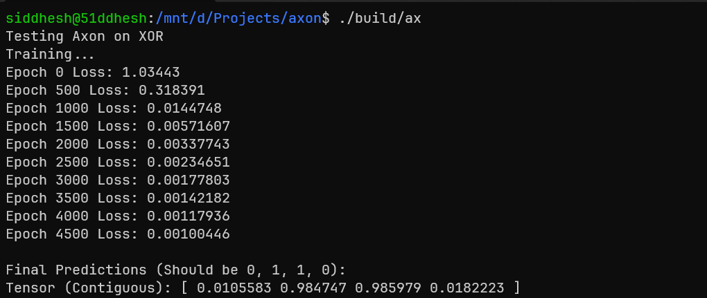
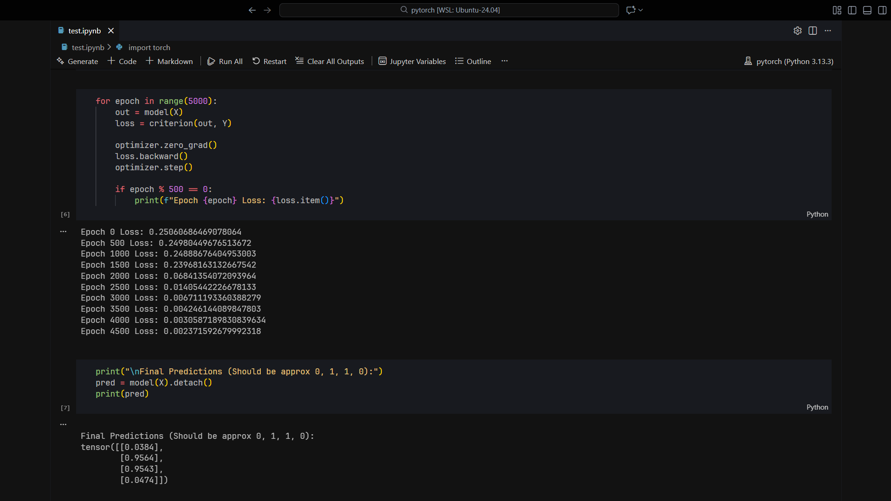

# Axon

A simple deep learning library inspired from PyTorch in C++.
<br>

## Usage:

The [`main.cpp`](./main.cpp) contains a simple XOR MLP Model. To train it, follow the instructions below.

1. Clone and navigate to `Axon`
```bash
git clone https://github.com/51ddhesh/axon && cd axon
```

2. Build and Compile
```bash
rm -rf build/
mkdir -p build
cmake -DCMAKE_BUILD_TYPE=Release -S . -B build/
cmake --build build/
```

3. Begin the training and view the predictions
```bash
./build/ax
```

## "Benchmark"


<center>XOR on Axon</center>


<center>XOR on PyTorch (Notebook)</center>


## Examples
The [`tests/`](./tests/) contains examples.

### LICENSE
Licensed under the [`MIT License`](./LICENSE)
